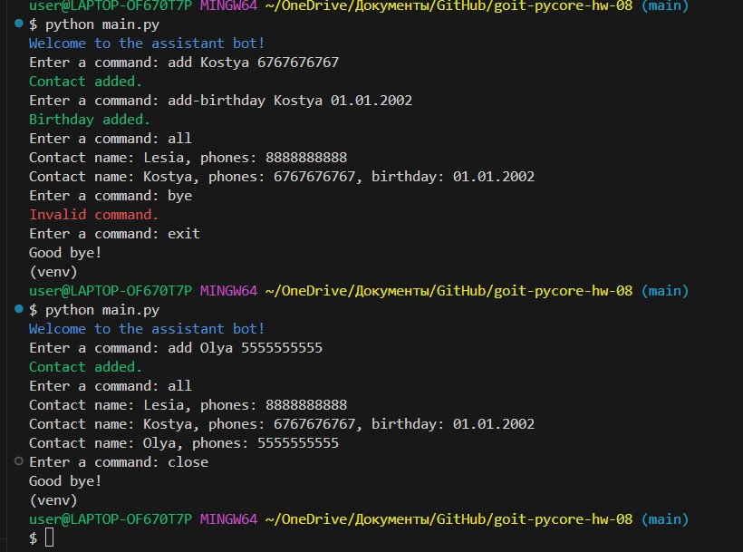

# Theme 10. Homework. Advanced Object-Oriented Programming in Python goit-pycore-hw-07

### Final result



## Technical task description

### Task 1

First, let's add additional functionality to the classes from the previous homework:

- Add a birthday field to the Record class for the date of birth. This field should be of the Birthday class. This field is optional but can only be one.

```
class Birthday(Field):
def **init**(self, value):
try: # Add data correctness check # and convert the string to a datetime object
except ValueError:
raise ValueError("Invalid date format. Use DD.MM.YYYY")

class Record:
def **init**(self, name):
self.name = Name(name)
self.phones = []
self.birthday = None
```

- Add functionality for working with Birthday in the Record class, namely the add_birthday function, which adds a birthday to the contact.
- Add functionality to check the correctness of the provided values for Phone and Birthday fields.
- Add and adapt our function from the fourth homework assignment, week 3, get_upcoming_birthdays, to the AddressBook class, which returns a list of users who need to be greeted by birthday within the next week.

Now your bot should work specifically with the functionality of the AddressBook class. This means that instead of the contacts dictionary, we use book = AddressBook().

### Task 2

To implement the new functionality, also add handler functions with the following commands:

- **add-birthday** - add a birthday to the contact in the format DD.MM.YYYY.
- **show-birthday** - display the birthday of the specified contact.
- **birthdays** - show birthdays that will occur during the next week.

```
@input_error
def add_birthday(args, book): # implementation

@input_error
def show_birthday(args, book): # implementation

@input_error
def birthdays(args, book): # implementation
```

#### So in the end, our bot should support the following command list:

1.  add [name] [phone]: Add a new contact with the name and phone number, or add a phone number to a contact that already exists.
2.  change [name] [old phone] [new phone]: Change the phone number for the specified contact.
3.  phone [name]: Show phone numbers for the specified contact.
4.  all: Show all contacts in the address book.
5.  add-birthday [name] [date of birth]: Add a date of birth for the specified contact.
6.  show-birthday [name]: Show the date of birth for the specified contact.
7.  birthdays: Show birthdays that will occur during the next week.
8.  hello: Receive a greeting from the bot.
9.  close or exit: Close the program.

```
    def main():
    book = AddressBook()
    print("Welcome to the assistant bot!")
    while True:
    user_input = input("Enter a command: ")
    command, \*args = parse_input(user_input)

            if command in ["close", "exit"]:
                print("Good bye!")
                break

            elif command == "hello":
                print("How can I help you?")

            elif command == "add":
                # implementation

            elif command == "change":
                # implementation

            elif command == "phone":
                # implementation

            elif command == "all":
                # implementation

            elif command == "add-birthday":
                # implementation

            elif command == "show-birthday":
                # implementation

            elif command == "birthdays":
                # implementation

            else:
                print("Invalid command.")
```

For example, let's consider the implementation of the add [name] [phone] command. In the main function, we need to add handling of this command to the appropriate place:

```
elif command == "add":
    print(add_contact(args, book))
```

The implementation of the add_contact function can look like this:

```
@input\*error
def add_contact(args, book: AddressBook):
name, phone, \*\* = args
record = book.find(name)
message = "Contact updated."
if record is None:
record = Record(name)
book.add_record(record)
message = "Contact added."
if phone:
record.add_phone(phone)
return message
```

### Evaluation Criteria:

1. Implement all specified commands for the bot.
2. All data should be displayed in a clear and user-friendly format.
3. All errors, such as incorrect input or missing contact, should be handled informatively with the appropriate message for the user.
4. Data validation:
   - The date of birth must be in the format DD.MM.YYYY.
   - The phone number must consist of 10 digits.
5. The program should close correctly after executing the close or exit commands.
